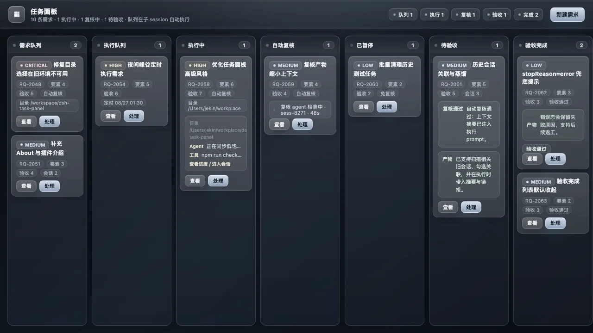

<p align="center">
  <h1 align="center">dsh-task-panel</h1>
</p>

<p align="center">
  <strong>把 DeepSeek Harness 会话升级成 AI 任务看板：排队执行、定时低峰运行、自动复核、验收返工、历史会话关联，一屏闭环。</strong>
</p>

<p align="center">
  <a href="https://github.com/chinazkk/dsh-task-panel/issues">Report an issue</a>
  · <a href="https://github.com/chinazkk/dsh-task-panel">View on GitHub</a>
</p>

<p align="center">
  <a href="LICENSE"></a>
  
  
  
</p>

> dsh-task-panel 是一个社区维护的 DSH 插件，非 DeepSeek 官方产品。

<p align="center">
  
</p>

> 上图为任务面板看板示例；新版流程为：需求队列 → 执行队列 → 执行中（实时进度预览，可一键直达子代理会话）→ 可选自动复核 → 已暂停 → 待验收（一句话产物 + 可选复核结论）→ 验收完成。

## 为什么值得装

如果你经常在 DSH 里连续丢多个需求，最痛的通常不是 agent 不会做，而是任务散在聊天里：哪个已排队、哪个正在跑、哪个要复核、哪个等你验收，时间久了很容易失焦。`dsh-task-panel` 把这些散落的对话收束成一个可视化任务流。

- **更稳的执行节奏**：双队列 + 子 agent 串行执行，避免多个任务一起抢上下文或互相覆盖。
- **更省心的低峰执行**：每个任务可指定计划时间，适合把耗资源任务安排到峰谷窗口。
- **更像真实交付流程**：执行完成后可自动复核，但最终通过/返工仍由你决定。
- **更少重复说明**：创建需求时可扫描并勾选相关历史会话，执行 prompt 自动带摘要和 sessionId。
- **更容易排错**：保留 stopReason、子会话链接、测试证据、复核结论和返工记录。

适合：持续维护插件/网站/脚本的小团队、个人自动化工作流、需要把 AI 编程任务排队跑完并保留验收痕迹的 DSH 用户。

## 这是什么

任务面板把「提需求 → 执行 → 可选自动复核 → 验收」做成一个七列看板 + 双队列的闭环，挂在 DSH 会话视图里（与「对话 / 轨迹」同级的「任务面板」标签页）：

- **需求队列 (backlog)** —— 提出/编辑/删除需求，自动拆解**构成要素**、生成**验收要素**，不自动执行。
- **执行队列 (queued)** —— 丢入后排队，由队列 worker 在**子 session** 中派发子 agent **串行**执行（同时仅 1 个 executing）；支持置顶 / 撤回 / **定时执行**，未到点任务会等待峰谷窗口且不阻塞后续即时任务。
- **执行中 (executing)** —— 实时进度预览（最近对话流 + 已运行时长），「查看进度」一键**直达对应子代理会话**（会话即实时进度）；执行 prompt 会带上已关联历史会话的 sessionId 和摘要片段；执行 agent 输出结构化交付：`done / summary / changedFiles / testCommand / testResult / blocker`。若子 agent 以 `stopReason=error` 结束，会明确标记为执行失败并直接进入待验收，方便人工查看和返工。
- **自动复核 (reviewing)** —— 每条需求可单独开启；开启后，执行完成会启动复核 agent，对照验收要素、改动文件和测试证据输出 `passed / verdict / issues / suggestions`，不直接替用户通过或打回；复核 prompt 只带压缩产物摘要，避免长日志/大产物撑爆上下文。
- **待验收 (accepting)** —— 展示**一句话产物 + 可选自动复核结论**，可「查看对话」（跳转真实子代理会话，不可跳转时回退对话摘要）。
- **验收闭环** —— 「通过」→ 验收完成；「返工」→ 填写反馈自动重入执行队列（≤5 次后退回需求队列防死循环）。
- **任务时间线** —— 每条需求记录创建、入队、执行开始、执行完成、复核完成、验收/返工等事件，方便排查队列状态。

## 推荐用法

1. 在「需求队列」点 **新建需求**，填标题、描述、绑定工作目录；面板会自动扫描相关历史会话，也可手动勾选关联；耗资源任务可设置「计划执行时间」放到低峰时段，也可按需勾选「自动复核」。
2. 点 **丢执行** 后任务进入执行队列。未到点的任务会等待，且不会阻塞后面的即时任务。
3. 勾选「自动复核」的任务执行完成后会进入 **自动复核**；未勾选的任务会直接进入「待验收」。
4. 在「待验收」里查看一句话产物；若开启过自动复核，会同时显示复核结论。你仍然拥有最终决定权。
5. 满意就点 **通过**；不满意点 **返工** 并写反馈，任务会带着反馈重入执行队列。

## 快速开始

需要一套可用的 DeepSeek Harness Web 安装。**不要**在任意目录里 `npm install`：用 `dsh plugin` 装进 Web profile 即可。

```bash
# 从 GitHub 安装（bundle 形态，lib/ 已随仓库提交，无需构建权限）
dsh plugin --profile web add github:chinazkk/dsh-task-panel

# 验证层组合
dsh --profile web --dump-config      # 输出应含 "# == dsh-task-panel" 层

# 启动（或重启现有 GUI），会话视图出现「任务面板」标签页
dsh --profile web
```

详细安装 / 升级 / 移除 / 排障见 [`docs/INSTALL-GUIDE.md`](docs/INSTALL-GUIDE.md)。

## 面板能力一览

| 阶段 | 你能做什么 |
| --- | --- |
| 需求队列 | 新建 / 编辑 / 删除 / 绑定工作目录 / 丢执行 |
| 执行队列 | 置顶 / 撤回 / 删除 / 定时执行（到点自动启动） |
| 执行中 | 实时进度预览 · 「查看进度」直达子代理会话 · 暂停 / 停止 |
| 自动复核 | 复核进度预览 · 查看复核会话 · 暂停 / 停止 |
| 已暂停 | 恢复（重入执行队列） |
| 待验收 | 一句话产物 · 可选自动复核结论 · 查看对话（跳转真实子会话 / 摘要回退）· 通过 / 返工（附反馈） |
| 验收完成 | 默认最多展示 5 条 · 展示更多/收起 · 查看对话 · 产物展开/收起 |

主 agent 工具集新增 8 个面板工具：`propose_requirement` / `edit_requirement` / `delete_requirement` / `dispatch_requirement` / `list_requirements` / `get_requirement` / `complete_execution` / `submit_acceptance`。

`propose_requirement`、`edit_requirement`、`dispatch_requirement` 均支持 `scheduledAt`：可传 ISO/可解析时间字符串；为空表示立即执行。适合把低优先级或耗资源任务安排到峰谷时段。

`propose_requirement`、`edit_requirement` 还支持 `autoReview`：`true` 表示执行完成后启动复核 agent，`false` 表示直接进入待验收。UI 新建需求默认勾选，可手动取消。

新建/编辑需求支持历史会话关联：UI 会根据标题/描述调用 `sessionQuery.searchSessions` 扫描候选会话，用户可勾选保留；工具/API 可传 `contextAnchors`（元素含 `sessionId/title/snippet/cwd`）。执行 prompt 会注入这些历史会话的摘要与 sessionId，帮助子 agent 复用旧上下文。

## 安全与边界

- **持久化**：状态写入**需求绑定目录根**下的 `.dsh-task-panel/requirements.json`（未绑定时回退部署 workspaceRoot，并自动迁移历史数据）；写入显式携带 `workspace-write` 沙箱策略，策略根按**根会话 cwd** 解析，绑定目录在会话工作区内即可落盘。
- **执行边界**：子 agent 的沙箱根跟随根会话 cwd——需求绑定目录需位于当前会话工作区内才能写文件。面板会自动规范化工作目录，避免把已在 `dsh-task-panel` 仓库根的路径再次拼成 `dsh-task-panel/dsh-task-panel`。
- **工具隔离**：执行器子 agent 作用域内 deny 面板管理工具，防止绕过队列元数据捕获。
- **自动复核边界**：复核 agent 只检查和给出结论，不自动验收；最终通过/返工仍由用户或主 agent 调 `submit_acceptance` 决定。
- **信号兜底**：宿主无 `AbortController` 时，从 `agent/pre-step` / `tools/execute` 事件捕获 `AbortSignal` 构造器生成「永不中断」信号，捕获不到时回退语义等价的鸭子类型信号——执行器初始化永不因缺信号失败。
- **失败可见性**：执行/复核子 agent 非正常停止时会保留 `stopReason`、会话 id 和失败摘要，不再把 `stopReason=error` 包装成“执行完成”。

## 架构

```
用户 / Agent / Web UI
   │ 新增/编辑/删除需求
   ▼
需求队列 (backlog) ── 不自动执行
   │ 丢执行 dispatch_requirement
   ▼
执行队列 (queued) ── 串行，可置顶/撤回/定时；未到点任务不会抢占 worker
   │ 队列 worker：subagents.start() 子 session 执行
   ▼
执行中 (executing) ── 实时进度 + 直达子代理会话
   ▼
可选自动复核 (reviewing) ── 勾选后由复核 agent 对照验收要素 / 改动 / 测试证据检查
   ▼
待验收池 (accepting) ── 一句话产物 + 可选自动复核结论 + 查看对话
   ├─ ✓ 通过 → 验收完成 (accepted)
   └─ ↻ 返工（填写反馈）→ 自动重入执行队列（≤5 次）
```

| 文件 | 平台 | 职责 |
| --- | --- | --- |
| `src/index.ts` → `lib/index.js` | Host | 数据模型 + 状态机 + 双队列调度 + 执行/复核子 session 派发 + 8 个 Agent 工具 + Client RPC（webServer 路由桥）+ 持久化 |
| `src/client/index.ts` → `lib/client.js` | Client（浏览器 bundle） | 七列看板 + 需求表单 + 历史会话勾选 + 可选复核结论 + 验收面板；经 `/plugins/dsh-task-panel/rpc` 调 Host |
| `cordis.patch.yml` | bundle 层 | 向 profile 插入 `dsh-task-panel` 插件行 |

Host/Client 通信：浏览器 Client 通过 `fetch('/plugins/dsh-task-panel/rpc')` 调用 Host 在 `webServer` 注册的 RPC 路由。

## 开发与验证

```bash
npm run build      # tsc（Host+Client 半）→ lib/，tsdown 打包浏览器 bundle lib/client.js
npm run typecheck
npm test           # 18 组断言冒烟测试：bundle host 全流程 + 历史会话关联 + 可选自动复核 + 异常停止 + client handoff + 真实渲染回归
npm run check      # build + test
dsh plugin --profile web add .    # 装本地目录，改代码后重新 build 即可
```

## 项目文档

- 项目介绍 / GitHub About 建议：[`docs/ABOUT.md`](docs/ABOUT.md)
- 安装 / 升级 / 排障：[`docs/INSTALL-GUIDE.md`](docs/INSTALL-GUIDE.md)
- 依赖清单（peer 依赖 / Host 服务 / Client 服务 / 构建期）：[`docs/DEPENDENCIES.md`](docs/DEPENDENCIES.md)
- 架构设计（本地化）：[`docs/architecture.html`](docs/architecture.html)

## License

Licensed under the [MIT License](LICENSE).
